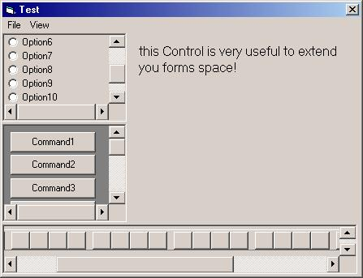



## \_ ISPanel a Great Option if you need more space in your Forms \! \! \_

### Description

Name: prjPanelTest

Description: this control is very useful for

those who need more space on their forms,

you can extend you form space using this

control, see example form  

how to use:  

1.- Insert a ISPanel Control in your form 

2.- Insert controls in a picture Box

3.- In the Form Load Event call the Attach Function and pass the picturebox as parameter. 

4.- In the Query Unload event call the detach Function 

 

Notes: 

the Control Captures the events of the Picturebox,

so if you resize the picturebox, the control adjust the scrollbars. 

Also, if you resize the ISPanel control, it adjust his properties 

Feedback and Votes are GREATLY appreciated ;)
 
### More Info
 

             |
---                |---
**Submitted On**   |2002-02-18 11:08:16
**By**             |[Fred\.cpp](https://github.com/Planet-Source-Code/PSCIndex/blob/master/ByAuthor/fred-cpp.md)
**Level**          |Beginner
**User Rating**    |4.8 (198 globes from 41 users)
**Compatibility**  |VB 5\.0, VB 6\.0
**Category**       |[Custom Controls/ Forms/  Menus](https://github.com/Planet-Source-Code/PSCIndex/blob/master/ByCategory/custom-controls-forms-menus__1-4.md)
**World**          |[Visual Basic](https://github.com/Planet-Source-Code/PSCIndex/blob/master/ByWorld/visual-basic.md)
**Archive File**   |[\_\_ISPanel\_55849218200\.zip](https://github.com/Planet-Source-Code/fred-cpp-ispanel-a-great-option-if-you-need-more-space-in-your-forms__1-31896/archive/master.zip)

### API Declarations

some :)

